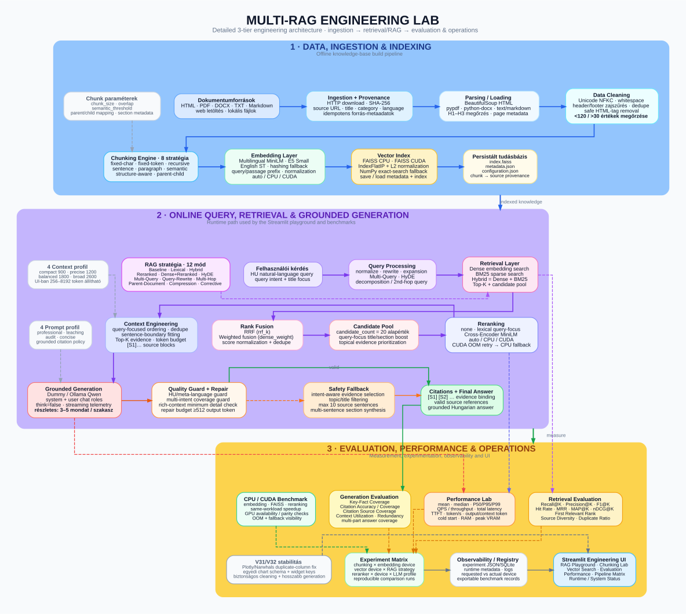

# Multi-RAG Engineering Lab

> Moduláris AI Engineering labor teljes Retrieval-Augmented Generation pipeline-ok építéséhez, összehasonlításához és profilozásához — a dokumentumfeldolgozástól és chunkolástól a retrievalön, rerankingen és grounded generáláson át egészen az evaluation és CPU/CUDA benchmarkokig.


A projekt szándékosan több egy egyszerű RAG chatbotnál. Egy **mérnöki kísérleti környezet**, amelyben külön vizsgálható, hogy az egyes pipeline-döntések hogyan hatnak a retrieval minőségére, a válasz groundednessére, a késleltetésre, az erőforrás-használatra és a rendszer stabilitására.

A reprodukálható demó egy forrásolt **magyar nyelvű orvosi dokumentumkorpuszt** használ. Az architektúra azonban más dokumentumhalmazokra is újrahasznosítható.



---

## Mit mutat be a projekt?

A rendszer a production szemléletű RAG pipeline fő elemeit külön cserélhető és mérhető komponensekként kezeli:

- dokumentumbetöltés, parsing, cleaning, provenance és deduplikáció;
- **8 különböző chunking stratégia**;
- többnyelvű embedding modellek helyi Hugging Face cache-sel;
- FAISS CPU, támogatott Linux/WSL környezetben FAISS GPU, illetve NumPy fallback;
- dense, BM25 és hybrid retrieval;
- Reciprocal Rank Fusion és weighted fusion;
- lexical és Cross-Encoder reranking;
- **12 RAG stratégia**, köztük Hybrid, Reranked, HyDE, Multi-Query, Query-Rewrite, Multi-Hop, Parent-Document, Contextual Compression és Corrective RAG;
- context budgeting, deduplikáció és source-diversity kezelés;
- lokális Ollama/Qwen grounded generálás citationnel, validationnel, repairrel és determinisztikus evidence fallbackkal;
- retrieval, generation, robustness és performance evaluation;
- CPU/CUDA összehasonlítás neurális komponenseknél;
- full-pipeline matrix benchmark és component profiling;
- Streamlit engineering UI;
- Docker, GitHub Actions CI és repository quality ellenőrzések.

A cél nem az, hogy egyetlen „legjobb” RAG pipeline-t nevezzünk meg, hanem hogy a **quality–latency–stability–resource trade-off mérhető és reprodukálható** legyen.

---

## Architektúra

```text
                         OFFLINE / INDEXING
Dokumentumok
   │
   ▼
Load → Parse → Clean → Provenance → Chunk
   │
   ▼
Embedding
   │
   ▼
FAISS / NumPy index
   │
   └────────────── persistent assets ──────────────┐
                                                   │
                         ONLINE / QUERY             │
Felhasználói kérdés                                │
   │                                               │
   ▼                                               │
Query processing                                   │
   │                                               │
   ▼                                               │
Dense / BM25 / Hybrid Retrieval ◄──────────────────┘
   │
   ▼
Fusion → Candidate Pool → opcionális Reranking
   │
   ▼
Context Builder
   │
   ▼
Ollama / Qwen Grounded Generation
   │
   ▼
Validation → Repair / Evidence Fallback → Citations
   │
   ▼
Végső válasz
   │
   ▼
Evaluation / Profiling / Experiment Registry
```

A backend hat nagy mérnöki domainre van bontva:

```text
rag_engine/
├── ingestion/       # loading, parsing, cleaning, chunking
├── indexing/        # embeddings, FAISS CPU/GPU, NumPy fallback
├── retrieval/       # query transformációk, dense/BM25/hybrid, fusion, reranking, context
├── generation/      # LLM providerek, promptok, grounded generation, validation, fallback
├── evaluation/      # quality metrikák, benchmarkok, robustness, statisztika, profiling
└── platform/        # konfiguráció, runtime, hardware és experiment infrastruktúra
```

A core AI logika nem függ a Streamlittől. A `rag_engine/` külön tesztelhető, a `ui/` kizárólag presentation layer.

---

## Támogatott pipeline stratégiák

### Chunking

| Stratégia | Fő cél |
|---|---|
| Fixed character | Gyors, determinisztikus baseline |
| Fixed token | Token budget alapú baseline |
| Recursive | Általános célú, természetes határok mentén történő felosztás |
| Sentence | Mondathatárok megőrzése |
| Paragraph | Bekezdésstruktúra megőrzése |
| Semantic | Témaváltások felismerése embeddingek alapján |
| Structure-aware | Címsorok és dokumentumhierarchia figyelembevétele |
| Parent–Child | Kis chunk retrieval, nagyobb parent context generáláshoz |

### Retrieval és reranking

```text
Dense / Vector ─┐
                ├─ RRF / Weighted Fusion ─→ Candidate Pool ─→ Reranker ─→ Top-K
BM25 / Sparse ──┘                                      │
                                                      ├─ None
                                                      ├─ Lexical / CPU
                                                      └─ Cross-Encoder / CPU vagy CUDA
```

### RAG stratégiák

A labor az alábbi konfigurációkat támogatja:

`Baseline` · `Hybrid` · `Lexical/BM25` · `Reranked` · `Dense + Reranked` · `HyDE` · `Multi-Query` · `Query-Rewrite` · `Multi-Hop` · `Parent-Document` · `Contextual Compression` · `Corrective RAG`

Minden stratégia ugyanazon evaluation infrastruktúrán keresztül fut, így az összehasonlítások konzisztensen elvégezhetők.

---

## Streamlit engineering workbench

A UI célja nem az, hogy elrejtse a pipeline-t, hanem hogy mérnöki szinten láthatóvá tegye.

Főbb területek:

- **Pipeline térkép** — a teljes rendszer 3 szintű áttekintése;
- **Dokumentumok és Knowledge Base** — corpus és provenance vizsgálata;
- **Chunking Lab** — chunking stratégiák és eloszlások összehasonlítása;
- **Embedding / Vector Search** — retrieval viselkedés vizsgálata;
- **RAG Playground** — interaktív kérdezés az aktív pipeline-nal;
- **RAG Comparison** — stratégiák egymás melletti összehasonlítása;
- **Teljes pipeline benchmark** — kontrollált end-to-end matrix evaluation;
- **Performance Lab** — latency, throughput és CPU/CUDA profiling;
- **Measurement Lab** — confidence interval, load test és robustness;
- **Experiments** — reprodukálható futások és konfigurációk;
- **Runtime / Infrastructure** — Ollama, CUDA, FAISS és hardware diagnosztika.

A full-pipeline benchmark a hiányzó evaluation asseteket közvetlenül a UI-ból is elő tudja készíteni, így nincs szükség kézi preprocessingre.

---

## Gyors indítás

### Windows

Az ajánlott runtime: **CPython 3.14 x64**.

```bat
SETUP.bat
INFRASTRUCTURE.bat setup
RUN.bat
```

A launcherek feladatai szét vannak választva:

| Launcher | Feladat |
|---|---|
| `SETUP.bat` | Python 3.14 virtual environment, Python dependencies, FAISS CPU baseline és regressziós tesztek |
| `INFRASTRUCTURE.bat` | CUDA/PyTorch, FAISS runtime, Ollama/Qwen, model cache, corpus/index előkészítés és diagnosztika |
| `RUN.bat` | Runtime ellenőrzés, infrastruktúra indítás és Streamlit UI |
| `EVALUATION.bat` | Retrieval/RAG evaluation, experiment registry és measurement suite |

Az első sikeres setup után napi használatra általában elég:

```bat
RUN.bat
```

### Linux / WSL

```bash
chmod +x SETUP.sh INFRASTRUCTURE.sh RUN.sh EVALUATION.sh
./SETUP.sh
./INFRASTRUCTURE.sh setup
./RUN.sh
```

### Docker

```bash
docker compose up --build
```

Ezután:

```text
http://localhost:8501
```

A Docker build támogatja a runtime assetek előkészítését is, így a modellek és az index nem feltétlenül az első alkalmazásindításkor készülnek el.

---

## Runtime assetek és reprodukálhatóság

A drága feldolgozási lépések szándékosan az interaktív query path-on kívül futnak.

A setup/infrastructure előkészítés során a rendszer képes:

1. letölteni és validálni a szükséges Hugging Face modelleket;
2. helyileg cache-elni őket;
3. retry/resume logikával letölteni a forrásolt orvosi korpuszt;
4. parse-olni, tisztítani és chunkolni a dokumentumokat;
5. elkészíteni a dokumentumembeddingeket;
6. létrehozni és perzisztálni a vector indexet.

A normál RAG kérdések így a már elkészített indexet használhatják a teljes corpus újraparsolása és újraembeddingelése helyett.

Tipikus lokális assetek:

```text
.cache/
├── huggingface/
└── sentence-transformers/

artifacts/
├── indexes/
├── evaluations/
├── experiments/
└── models/
```

A generált datasetek, indexek és benchmark outputok nincsenek source controlban, mert a pipeline-ból reprodukálhatók.

---

## Evaluation módszertan

### Retrieval minőség

A projekt többek között az alábbi metrikákat méri:

- Recall@K
- Precision@K / F1@K
- Hit Rate
- MRR
- MAP@K
- nDCG@K
- R-Precision
- Context Precision@K
- source diversity
- duplicate ratio
- no-hit / late-hit rate
- bootstrap confidence interval

Ezekkel különválasztható a **candidate recall** és a **ranking quality**. Előfordulhat ugyanis, hogy a megfelelő evidence bekerül a candidate poolba, de túl alacsony helyre rangsorolódik.

### Grounded answer quality

A generation evaluation része:

- citation accuracy és citation coverage;
- question-part / key-fact coverage;
- context utilization;
- answer redundancy;
- repair rate;
- deterministic fallback rate.

A projekt tudatosan nem használ egyetlen nehezen magyarázható „AI quality score”-t abszolút igazságként.

### Performance

A profiling réteg méri:

- retrieval latency;
- reranking latency;
- generation latency;
- end-to-end latency;
- TTFT;
- tokens/s;
- P50 / P90 / P95 / P99;
- throughput / QPS;
- szórás és coefficient of variation;
- bootstrap latency confidence interval;
- concurrency scaling.

### Robustness

A query-k determinisztikus perturbációkkal is tesztelhetők, például:

- kisbetűsítés;
- ékezetek eltávolítása;
- írásjelek eltávolítása;
- whitespace-eltérés.

Mért stabilitási mutatók:

- Top-K overlap;
- ranking stability;
- Top-1 retention.

A cél a retrieval érzékenységének feltárása, nem csak az ideális query-k mérése.

---

## CPU vs CUDA

A neurális embedding és Cross-Encoder reranking CPU-n és CUDA-n is futtatható PyTorchon keresztül.

A CUDA gyorsulás megfelelő workload mellett látványos lehet, azonban a pontos eredmény függ például:

- GPU-tól és VRAM-tól;
- CUDA/PyTorch buildtől;
- modelltől;
- batch size-tól;
- candidate counttól;
- corpusmérettől.

Ezért a repository **nem állít univerzális „X× gyorsabb” eredményt**. A benchmark infrastruktúra azért része a projektnek, hogy mindenki a saját hardverén, azonos workload mellett mérhesse meg a különbséget.

```bash
python scripts/verify_acceleration.py
python scripts/benchmark_devices.py --workload 500
```

A FAISS GPU Linux/WSL + Conda környezetben támogatott:

```bash
python scripts/check_faiss_gpu.py
```

Natív Windows alatt a FAISS CPU a stabil baseline, miközben az embedding és a Cross-Encoder reranking továbbra is használhat CUDA-t.

---

## Tesztelés

A különböző tesztrétegek különböző hibákat fognak meg.

| Tesztréteg | Mit ellenőriz? |
|---|---|
| Unit | Chunking, cleaning, retrieval metrikák, vector store, konfiguráció és generation guardok |
| Integration | Többkomponensű RAG flow-k és stratégia-orchestration |
| UI / contract | Streamlit state kezelés, Arrow-safe táblák és page contractok |
| Performance smoke | Benchmark és measurement pipeline működőképessége |
| Repository contract | Architektúrahatárok, generált fájlok és gépspecifikus pathok |
| Package build | Python packaging |
| Docker build | Reprodukálható CPU container build |

A legutóbb validált regressziós futás:

```text
137 passed
6 environment-dependent skipped
```

A skipelt tesztek olyan runtime képességeket igényelnek, amelyek a validációs környezetben nem voltak elérhetők, például valódi CUDA/FAISS GPU backend vagy teljes Streamlit AppTest runtime.

Lokális ellenőrzés:

```bash
pytest -q
python scripts/check_repository.py
python -m compileall -q rag_engine ui scripts tests
ruff check rag_engine ui scripts tests
```

---

## CI

A GitHub Actions külön quality gate-ekre bontja a projektet:

```text
Repository / Quality
        │
        ├── Unit tests
        ├── RAG integration + performance smoke
        ├── Measurement-suite smoke
        ├── Streamlit UI smoke
        ├── Python package build
        └── Docker build
                 │
                 ▼
               CI Gate
```

Az alapértelmezett CI:

- Python 3.14-et használ;
- nem igényel fizetős LLM API-t;
- nem igényel NVIDIA GPU-t;
- determinisztikus CPU-kompatibilis teszteket futtat;
- ellenőrzi a repository architektúráját;
- felépíti a Python package-et és a Docker image-et.

A valódi CUDA / FAISS GPU ellenőrzéshez külön, manuálisan indítható self-hosted workflow használható.

---

## Projektstruktúra

```text
multi-rag-engineering-lab/
├── rag_engine/
├── ui/
├── config/
├── data/
├── artifacts/
├── scripts/
├── tests/
├── docs/
├── .github/workflows/
├── pyproject.toml
├── Dockerfile
├── compose.yml
├── SETUP.bat / SETUP.sh
├── INFRASTRUCTURE.bat / INFRASTRUCTURE.sh
├── RUN.bat / RUN.sh
└── EVALUATION.bat / EVALUATION.sh
```

A részletes struktúra és a tervezési döntések itt találhatók:

[`docs/project-structure.md`](docs/project-structure.md)

---

## Dokumentáció

- [Architektúra](docs/architecture.md)
- [Projektstruktúra](docs/project-structure.md)
- [Setup](docs/setup.md)
- [RAG pipeline-ok](docs/rag-pipelines.md)
- [Evaluation](docs/evaluation.md)
- [Measurement módszertan](docs/measurement.md)
- [Experiments](docs/experiments.md)
- [FAISS GPU](docs/faiss-gpu.md)
- [Tesztelés](docs/testing.md)
- [CI és quality gate-ek](docs/ci.md)
- [Streamlit UI](docs/ui.md)

---

## Tervezési alapelvek

A repository néhány tudatos mérnöki szabályt követ:

- a drága ingestion/indexing lépéseket újra kell használni, nem query-nként újrafuttatni;
- a UI, business logic, retrieval és infrastruktúra külön rétegek;
- a GPU gyorsítás opcionális, CPU fallback mellett;
- a hibák explicit módon degradálódjanak, ne csendben;
- a benchmarkeredmények konfigurációból és datasetből reprodukálhatók legyenek;
- generált artifactok és hardverspecifikus benchmarkértékek ne kerüljenek be univerzális igazságként a repóba;
- a rendszer legyen annyira observable, hogy meg lehessen mondani, **miért lassú vagy pontatlan egy adott pipeline**.

---

## Jogi és szakmai megjegyzés

A projektben használt orvosi korpusz demonstrációs, retrieval és evaluation célokat szolgál. A generált válaszok **nem minősülnek orvosi tanácsnak**, és nem helyettesítik az egészségügyi szakember által végzett diagnózist vagy kezelést.

---

## Miért készült ez a repository?

A projekt célja annak bemutatása, hogy egy RAG rendszer mögött jóval több mérnöki munka van, mint egy egyszerű chatfelület:

**adatminőség → chunking → reprezentáció → retrieval → ranking → context engineering → grounded generation → validation → measurement → deployment**

A cél nem pusztán az, hogy a RAG „működjön”, hanem hogy a viselkedése **érthető, tesztelhető, összehasonlítható és reprodukálható** legyen.
