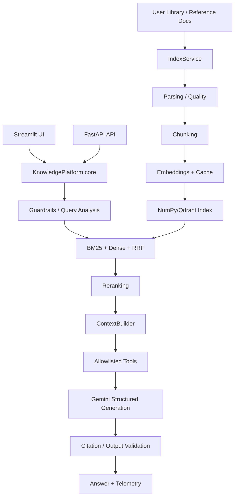

# Architecture

## Runtime boundaries

The Streamlit UI and FastAPI API are **parallel adapters** over the same `tkip` core package. The UI does not need to call the API internally; external clients use FastAPI.

## Core boundaries

- `IndexService` owns ingestion/index lifecycle.
- `KnowledgePlatform` owns one request lifecycle.
- `HybridRetriever` owns native retrieval; LangChain is only an optional adapter.
- `GeminiService` owns provider communication and structured generation.
- `ContextBuilder` owns selection/budgeting, not retrieval.
- `Telemetry` owns persistence of operational traces.

## Failure isolation

Document parsing failures are isolated per document. Reranker/vector-store optional failures can fall back to simpler supported behavior. Gemini quota/auth errors are surfaced as explicit domain errors rather than silently masquerading as a generated answer.
