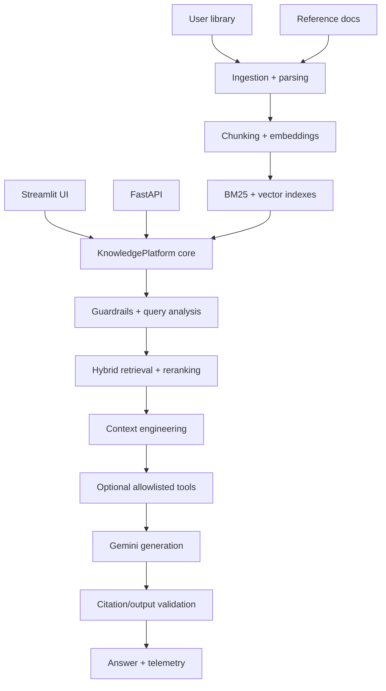

# Technical Knowledge Intelligence Platform

Production-oriented AI Engineering portfolio project for querying a technical knowledge library with hybrid RAG, reranking, Gemini, tool calling, evaluation, monitoring and an inspectable Streamlit/Plotly UI.

The repository is structured as an engineering system, not a chatbot demo: ingestion, parsing, chunking, retrieval, context construction, generation, validation, evaluation, telemetry, API/UI adapters, tests and deployment are separated.

## Main capabilities

- PDF, DOCX, TXT, Markdown, HTML and EPUB ingestion.
- Stable document IDs, checksums and incremental caches.
- Fixed, recursive, structure-aware and semantic chunking experiments.
- BM25 + dense retrieval + Reciprocal Rank Fusion + reranking.
- Persistent index variants for reproducible retrieval benchmarks.
- Gemini grounded generation with explicit insufficient-evidence behavior.
- Prompt-engineering profiles and A/B tests.
- Allowlisted backend tool calling.
- Citation validation and source-aware diagnostics.
- Retrieval, RAG, robustness, regression and performance evaluation.
- Request latency/token/cost telemetry and failure analysis.
- Streamlit research UI and a separate FastAPI service adapter.

## Architecture



The Streamlit UI does not need the FastAPI server internally. Both are adapters over the same `tkip` core.

## Knowledge collections

The previous `private_books` / `public_docs` naming was too narrow. The project now uses:

- `01_data/user_library/` — your own books, notes and internal documents. This directory is ignored by Git and excluded from release ZIPs by default.
- `01_data/reference_docs/` — public documentation snapshots, original demo summaries and other rebuildable reference material. Only redistribute files whose licenses permit it.

Internally, older index metadata can still contain the technical source values `private` and `public`; the UI presents the clearer collection names above.

You can add documents in two ways:

1. Open **Library → Add documents** in the UI, choose the collection, upload files, then use **Upload + rebuild index**.
2. Copy files manually into one of the two folders and use **Rebuild index only** or `run_project.bat ingest`.

Full details: [Data & library guide](09_docs/03_DATA_PIPELINE.md).

## Repository structure

```text
technical-knowledge-intelligence/
├── 00_setup/                  environment checks
├── 01_data/
│   ├── user_library/          local user-owned/private corpus
│   ├── reference_docs/        demo/public/rebuildable references
│   ├── evaluation/            evaluation datasets
│   ├── indexes/               generated indexes
│   ├── interim/               intermediate artifacts
│   └── processed/             manifests/caches/telemetry
├── 02_notebooks/              analysis notebooks
├── 03_pipeline/tkip/          installable AI/RAG core package
├── 04_api/                    FastAPI adapter
├── 05_scripts/                launcher/release utilities
├── 05_ui/                     Streamlit + Plotly UI
├── 06_tests/                  automated tests
├── 07_results/                benchmark/evaluation outputs
├── 08_logs/                   runtime logs
├── 09_docs/                   engineering documentation
├── 10_deployment/             deployment assets
├── configs/                   configuration examples
├── run_project.bat/.sh        daily command runner
└── setup.bat/.sh              first-run setup wrapper
```

## Quick start

### Windows

First run:

```bat
setup.bat
```

Daily use:

```bat
run_project.bat
```

`run_project.bat` starts one Streamlit application process. FastAPI is intentionally separate because the UI calls the shared core directly.

Start the API only when you need an external HTTP service:

```bat
run_project.bat api
```

### Linux / macOS

```bash
chmod +x setup.sh run_project.sh
./setup.sh
# later
./run_project.sh
```

## Gemini

Put the key in `.env` or enter it in the Streamlit sidebar:

```env
GEMINI_API_KEY=your_api_key_here
```

`.env` is ignored by Git. Offline retrieval and deterministic tests do not require Gemini quota.

## Useful commands

```bat
run_project.bat run             rem Streamlit UI only
run_project.bat api             rem FastAPI only
run_project.bat ingest          rem rebuild corpus index
run_project.bat public          rem download supported public reference snapshots
run_project.bat index-variants  rem build chunk/index experiment variants
run_project.bat list-indexes    rem inspect index variants
run_project.bat benchmark       rem retrieval benchmark
run_project.bat evaluate        rem deterministic generation evaluation
run_project.bat failure         rem failure report
run_project.bat figures         rem generate result figures
run_project.bat test offline    rem deterministic test suite
run_project.bat test live       rem explicit live Gemini tests
run_project.bat quality         rem lint + format check + mypy + offline tests
```

## Dependency model

`pyproject.toml` is the dependency source of truth.

```bash
python -m pip install -e .          # runtime
python -m pip install -e ".[dev]"  # tests/lint/type checking
python -m pip install -e ".[full]" # optional Qdrant/SentenceTransformers/LangChain/Graphviz
```

The default local vector backend is NumPy so the project works without extra infrastructure. Qdrant server remains optional.

## Testing

Default deterministic run:

```bat
run_project.bat test offline
```

The suite covers unit, integration, evaluation, regression, robustness, performance and smoke contracts. Live Gemini tests are opt-in.

See [Testing](09_docs/06_TESTING.md).

## Documentation

Start here:

- [Project overview](09_docs/01_PROJECT_OVERVIEW.md)
- [Architecture](09_docs/02_ARCHITECTURE.md)
- [Data & library](09_docs/03_DATA_PIPELINE.md)
- [AI / RAG pipeline](09_docs/04_AI_PIPELINE.md)
- [Evaluation](09_docs/05_EVALUATION.md)
- [Testing](09_docs/06_TESTING.md)
- [Deployment](09_docs/07_DEPLOYMENT.md)
- [Troubleshooting](09_docs/08_TROUBLESHOOTING.md)
- [Design decisions](09_docs/09_DESIGN_DECISIONS.md)
- [Portfolio story](09_docs/PROJECT_STORY.md)

Specialized documents are kept only when they add material not already covered by the core documentation.

Release changes: [CHANGELOG.md](CHANGELOG.md).
