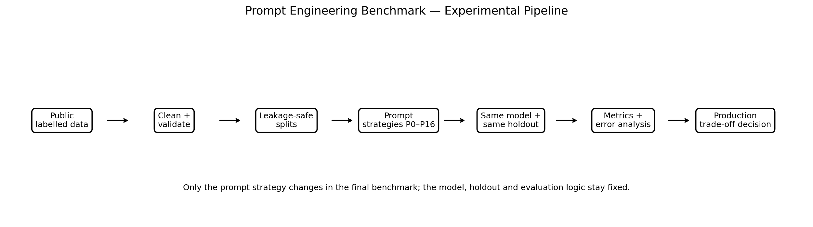
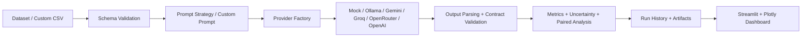
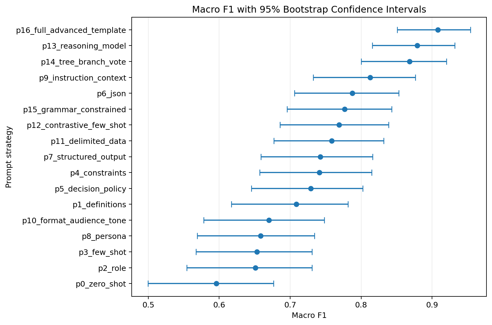
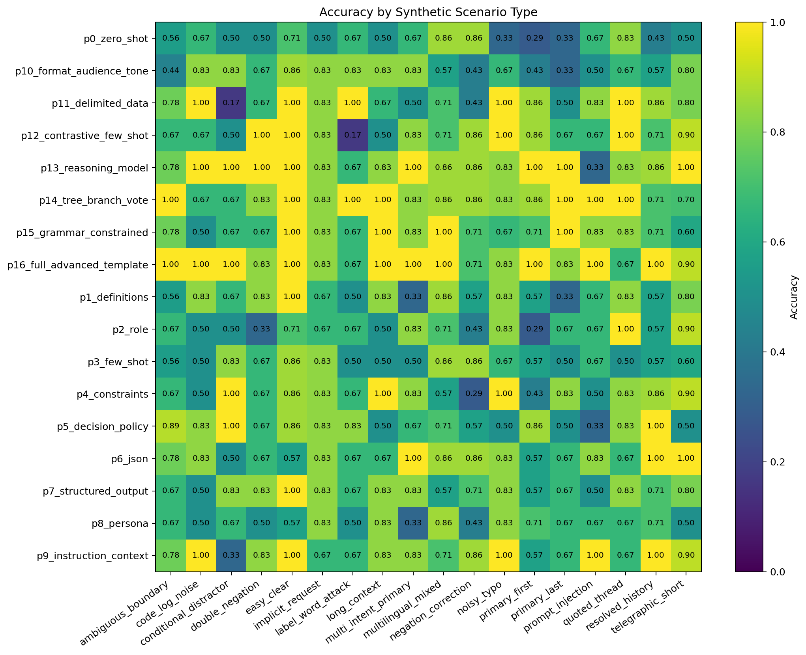
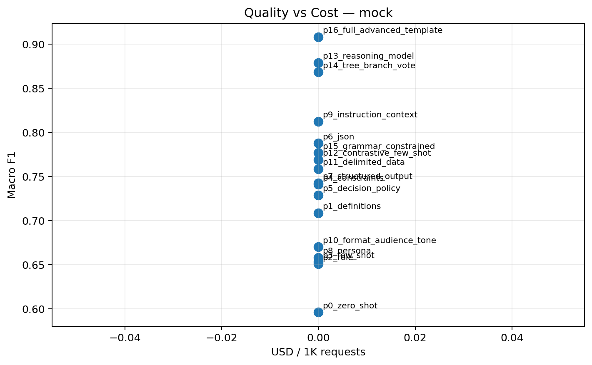
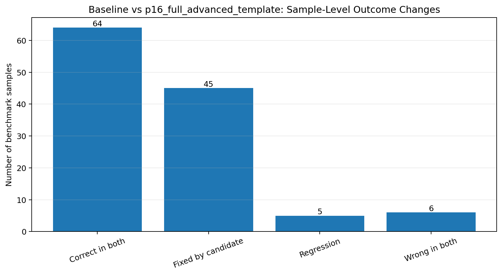

<div align="center">

# Prompt Engineering Benchmark Lab

### A reproducible AI Engineering laboratory for measuring prompt quality, robustness, structured-output reliability, token efficiency, latency, and cost.

[](https://www.python.org/)
[](docs/en/16_VALIDATION_RESULTS.md)
[](docs/en/16_VALIDATION_RESULTS.md)
[](https://streamlit.io/)
[](https://plotly.com/python/)
[](Dockerfile)
[](06_deployment/kubernetes/README.md)
[](LICENSE)

**[English Docs](docs/en/00_DOCUMENTATION_INDEX.md) · [Magyar dokumentáció](docs/hu/00_DOCUMENTATION_INDEX.md) · [Test Catalog](docs/en/13_TEST_CATALOG.md) · [Project Story](docs/en/14_PROJECT_STORY.md)**

</div>

---

## Why this project exists

Prompt engineering is often evaluated by looking at a few examples and deciding that one prompt *"looks better"*. That is not enough for production AI systems.

This project treats prompt engineering as an **engineering and experimentation problem**. It keeps the dataset, provider, model, sampling configuration, evaluation protocol, and output contract controlled, then measures how prompt design changes:

- task quality and class-level behaviour;
- robustness on difficult and adversarial inputs;
- structured-output reliability;
- input/output token consumption;
- latency and throughput;
- estimated API cost;
- regressions versus a fixed baseline.

The result is not a prompt collection. It is a **reproducible Prompt Engineering benchmark platform** with an interactive UI, experiment history, custom prompts, A/B testing, provider adapters, statistical evaluation, deployment assets, and a documented test system.

> **Portfolio goal:** demonstrate that I can design, implement, evaluate, validate, and productionize an LLM experimentation system — not only write prompts.

---

## What this repository demonstrates

| Area | Engineering capability demonstrated |
|---|---|
| **Prompt Engineering** | Zero-shot, definitions, role/system prompts, few-shot, constraints, decision policies, structured output, persona/context/audience/tone, contrastive examples, reasoning-oriented strategies, branch-and-vote and custom prompts |
| **LLM Evaluation** | Accuracy, Macro F1, balanced accuracy, MCC, Cohen's κ, uncertainty intervals, class-wise analysis, scenario analysis, output validity and paired comparison |
| **Experiment Design** | Fixed holdout, development split, leakage protection, deterministic stratified pilots, ablation studies and decoding-parameter sweeps |
| **LLM Engineering** | Provider abstraction, retries, timeout handling, response normalization, token tracking, latency measurement, output parsing and cost estimation |
| **Production Thinking** | Run history, configuration management, logging, input validation, package architecture, tests, Docker, Kubernetes and security hygiene |
| **Developer Experience** | Single bilingual Streamlit UI, Windows/Linux launchers, custom prompt presets, Playground A/B testing and reusable CLI workflows |

---

## System at a glance

<p align="center">
  
</p>



The runtime code lives in the installable `prompt_benchmark` package. Streamlit is only the presentation layer; benchmark, provider, validation, history, and evaluation logic remain reusable from scripts, CLI commands, tests, and notebooks.

---

## Core features

### 1. P0–P16 controlled prompt benchmark

The project includes a progressive benchmark ladder instead of unrelated prompt examples:

| ID | Strategy | Main hypothesis |
|---|---|---|
| **P0** | Zero-shot baseline | Establish the minimum prompt baseline |
| **P1** | Label definitions | Explicit semantics reduce class confusion |
| **P2** | Role / system prompt | Role framing improves task adherence |
| **P3** | Few-shot | Demonstrations clarify input → label mapping |
| **P4** | Explicit constraints | Strong rules reduce invalid and off-task outputs |
| **P5** | Decision policy | Explicit decision criteria improve ambiguous cases |
| **P6** | Prompt-only JSON | Format instructions improve machine readability |
| **P7** | Structured Output | Schema enforcement improves output-contract reliability |
| **P8–P10** | Persona / context / audience / tone | Measure richer prompt-template components independently |
| **P11** | Delimited input | Input isolation improves robustness against instruction-like data |
| **P12** | Contrastive few-shot | Boundary examples reduce similar-class confusion |
| **P13** | Reasoning-oriented configuration | More deliberate processing may improve difficult cases |
| **P14** | Branch + vote | Multiple independent decisions can improve robustness |
| **P15** | Grammar/schema constrained | Constrained generation improves output validity |
| **P16** | Full advanced template | Measure the combined quality/cost trade-off |

Every strategy can be inspected directly in the UI and in `configs/prompts/`.

### 2. Custom prompts and Playground A/B testing

The Playground supports both **classification** and **free-text generation**.

You can:

- choose any P0–P16 strategy;
- write and save custom prompt presets;
- compare A vs B prompts on the same input;
- independently change `temperature`, `top_p`, `top_k`, and max output tokens;
- inspect the rendered prompt sent to the provider;
- compare output validity, tokens, latency, and task-specific criteria;
- keep Playground history between UI sessions.

### 3. Live benchmark execution

Benchmark runs are visible rather than running as a black box. During execution the UI reports:

- overall and per-strategy progress;
- current sample and current strategy;
- live Accuracy and Macro F1;
- cumulative token usage;
- cumulative latency;
- latest prediction / ground truth;
- partial leaderboard and Plotly charts.

Every completed run receives a `run_id` and persists its dataset snapshot, raw predictions, summary, difficulty/scenario analysis, and manifest under:

```text
07_outputs/results/history/<run_id>/
```

### 4. Dataset stress testing

The offline challenge generator creates:

```text
10,800 unique raw tickets
6 classes
18 scenario families
3,000 development examples
6,000 final holdout examples
24 fixed few-shot examples
```

The scenario families include straightforward, ambiguous, multi-intent, noisy, long-context, prompt-injection, quoted-history, multilingual, negation, code/log-noise, and other stress cases.

Small benchmark profiles are **deterministically stratified by label and scenario**, so a 36-sample pilot is not simply the first 36 easy rows.

> The challenge data is synthetic by design. It is useful for controlled stress testing, but real portfolio evidence should complement it with a live LLM and, ideally, an external or human-reviewed evaluation set.

---

## Evaluation framework

The benchmark intentionally goes beyond a single accuracy number.

### Quality

- Accuracy + Wilson 95% confidence interval
- Macro Precision / Recall / F1
- Bootstrap 95% CI for Macro F1
- Weighted F1
- Balanced Accuracy
- Matthews Correlation Coefficient
- Cohen's Kappa
- Per-class Precision / Recall / F1
- Confusion matrix
- Hard-case quality
- Scenario-family quality

### Reliability

- output-contract valid rate
- invalid-output rate
- JSON validity / grammar validity
- API error rate
- fixed vs regressed examples against P0
- paired baseline analysis / McNemar test where applicable

### Operational metrics

- mean input / output / total tokens
- total benchmark token consumption
- tokens per correct prediction
- P50 / P95 / P99 latency
- throughput
- estimated cost / request
- estimated cost / 1,000 requests
- cost per correct prediction
- prompt complexity and branch count

> Mock token and latency values are explicitly marked as `estimated_mock` / `simulated_mock`. They are never presented as real provider measurements.

---

## Example analysis views

<table>
<tr>
<td width="50%">

</td>
<td width="50%">

</td>
</tr>
<tr>
<td align="center"><b>Quality + uncertainty</b></td>
<td align="center"><b>Where each prompt succeeds or fails</b></td>
</tr>
</table>

<table>
<tr>
<td width="50%">

</td>
<td width="50%">

</td>
</tr>
<tr>
<td align="center"><b>Quality / cost trade-off</b></td>
<td align="center"><b>Improvement is analysed together with regressions</b></td>
</tr>
</table>

> These checked-in figures are generated by the **mock prompt-sensitive simulator** so the repository is inspectable without API credentials. They demonstrate the analytics pipeline, not real LLM quality. Use Ollama or a live cloud provider for real-model benchmark evidence.

---

## Verified engineering quality

The repository contains a real pytest suite rather than placeholder tests.

```text
Full suite:     76 passed, 0 failed
Unit:           53 passed
Integration:    22 passed
Smoke:           1 passed
Core coverage:  77%
```

Representative tested areas include:

- dataset validation and leakage protection;
- prompt rendering and prompt strategy behaviour;
- output parsing and malformed JSON handling;
- metrics and uncertainty calculations;
- benchmark caching and cache invalidation;
- custom prompts and A/B Playground regressions;
- run-history persistence;
- provider factories and adapter boundaries;
- pricing and token/cost calculations;
- language/session behaviour;
- edge cases such as missing credentials, invalid configuration, invalid predictions, and stale cached data.

Detailed evidence:

- [Validation results](docs/en/16_VALIDATION_RESULTS.md)
- [Complete English test catalog — all 76 tests explained](docs/en/13_TEST_CATALOG.md)
- [Teljes magyar tesztkatalógus](docs/hu/13_TEST_CATALOG.md)

---

## Supported providers

| Provider | Use case | API key required? |
|---|---|---:|
| **Mock simulator** | Offline development, tests, deterministic UI demonstration | No |
| **Ollama** | Local real LLM benchmark without per-token API billing | No |
| **Gemini** | Cloud LLM benchmark | Yes |
| **Groq** | Low-latency cloud inference | Yes |
| **OpenRouter** | Access multiple hosted models behind one adapter | Yes |
| **OpenAI** | Cloud LLM benchmark / structured outputs where supported | Yes |

Provider-specific limits, model availability, free tiers, and pricing can change. The project therefore keeps provider/model/pricing configuration outside benchmark logic.

Secrets are never committed. API keys can be entered in the UI for the current process or supplied through environment variables.

---

# Quick Start

## Windows — recommended

```bat
run_project.bat
```

The launcher:

1. enters the repository root;
2. validates Python compatibility;
3. creates `.venv` when needed;
4. checks/updates dependencies;
5. installs the project as an editable package;
6. validates the environment;
7. prepares required local data if necessary;
8. starts the single bilingual Streamlit UI.

Run tests:

```bat
run_tests.bat
```

`RUN_UI.bat` remains as a backward-compatible alias.

## Linux / macOS

```bash
chmod +x run_project.sh run_tests.sh
./run_project.sh
```

Tests:

```bash
./run_tests.sh
```

## Manual setup

```bash
python -m venv .venv
```

Windows:

```bat
.venv\Scripts\activate
```

Linux/macOS:

```bash
source .venv/bin/activate
```

Install and run:

```bash
python -m pip install --upgrade pip
python -m pip install -r requirements-dev.txt
python -m pip install -e . --no-build-isolation
streamlit run 05_scripts/11_ui_app.py
```

Optional provider configuration:

```bash
cp .env.example .env
```

Never commit `.env`.

---

## Recommended UI workflow

```text
1. Provider / API
        ↓
2. Dataset
        ↓
3. Playground / Custom Prompt
        ↓
4. Benchmark
        ↓
5. Output Validation
        ↓
6. Dashboard
        ↓
7. History / Comparison
```

The UI is bilingual. Language can be switched inside the application without starting a separate UI process.

### Suggested first run

For a cloud provider, do not begin with the 6,000-sample holdout.

Use:

```text
pilot → 36 stratified samples / strategy
standard → 120
strong → 300
full → entire holdout
```

Then scale only after connectivity, output contracts, and rate limits are verified.

---

## CLI and scripts

The installed CLI exposes common tasks:

```bash
prompt-benchmark prepare-data --source mock
prompt-benchmark smoke
prompt-benchmark ui
```

A controlled benchmark can also be launched through the script layer:

```bash
python 05_scripts/04_run_benchmark.py \
  --provider mock \
  --strategy p0_zero_shot \
  --limit 36
```

Run the reproducible pipeline wrapper:

```bash
python 05_scripts/00_run_pipeline.py \
  --provider mock \
  --source mock \
  --profile standard \
  --strategy all \
  --force
```

Individual scripts remain available for data preparation, provider checks, benchmark execution, ablation, parameter sweeps, report generation, fine-tuning export, custom prompts, and API-integration examples.

---

## Project structure

```text
prompt-engineering-benchmark-lab/
│
├── 00_setup/                       # Environment/bootstrap helpers
│
├── 01_data/
│   ├── external/                   # Optional external evaluation data
│   ├── fine_tuning/                # SFT-ready exports
│   ├── mock/                       # Offline generated challenge data
│   ├── processed/                  # Development / holdout benchmark splits
│   └── sample/
│
├── 02_notebooks/                   # 10 explanatory, executable notebooks
│
├── 03_src/
│   └── prompt_benchmark/           # Installable application package
│       ├── benchmark/              # Runner, cache, experiment execution
│       ├── data/                   # Generation, preparation, validation
│       ├── evaluation/             # Metrics, bootstrap, plots, analysis
│       ├── llm/
│       │   └── providers/          # Gemini/Groq/Ollama/OpenAI/OpenRouter/Mock
│       ├── prompts/                # Built-in and custom prompt logic
│       ├── ui/                     # Reusable Streamlit panels/history
│       ├── utils/                  # Logging, pricing, helpers
│       ├── cli.py
│       ├── config.py
│       └── paths.py
│
├── 04_tests/                       # Unit, integration, smoke, regression tests
│
├── 05_scripts/                     # User-facing execution entrypoints
│
├── 06_deployment/
│   └── kubernetes/                 # Namespace, Deployment, Service, ConfigMap
│
├── 07_outputs/
│   ├── logs/
│   ├── reports/
│   └── results/                    # Raw results + persistent run history
│
├── configs/
│   ├── prompts/                    # P0–P16, HU templates, examples, presets
│   ├── benchmark.yaml
│   ├── parameter_sweeps.yaml
│   ├── pricing.yaml
│   └── providers.yaml
│
├── docs/
│   ├── en/                         # 30 English engineering documents
│   └── hu/                         # 30 paired Hungarian documents
│
├── Dockerfile
├── pyproject.toml
├── requirements.txt
├── requirements-dev.txt
├── run_project.bat / run_project.sh
├── run_tests.bat / run_tests.sh
└── README.md
```

The complete file tree is documented in [Project Structure](docs/en/17_PROJECT_STRUCTURE.md).

---

## Notebooks

The notebooks are intentionally educational while reusable logic remains in the Python package.

```text
01  Data Understanding
02  Prompt Design
03  Benchmark
04  Error Analysis
05  Prompt Ablation
06  Final Analysis
07  Advanced Prompt Engineering
08  Decoding Parameters
09  Prompt Template & Output Validation
10  Fine-tuning Readiness
```

Each follows the pattern:

```text
Why → Theory → Code → Result → Interpretation → Engineering Decision
```

See the [Notebook Guide](docs/en/18_NOTEBOOK_GUIDE.md).

---

## Reproducibility and experiment integrity

The benchmark protects experiment validity through:

- fixed local random seeds where applicable;
- development / final-holdout separation;
- few-shot leakage checks;
- dataset snapshots per persisted run;
- model/provider/settings recorded in run manifests;
- deterministic stratified pilot sampling;
- cache identity checks against data and inference settings;
- raw predictions retained for audit and regression analysis.

LLM APIs can still be nondeterministic despite fixed local seeds. That limitation is documented rather than hidden.

---

## Docker

Build:

```bash
docker build -t prompt-engineering-benchmark-lab .
```

Run locally:

```bash
docker run --rm -p 8501:8501 prompt-engineering-benchmark-lab
```

Pass provider secrets at runtime rather than baking them into the image:

```bash
docker run --rm -p 8501:8501 \
  -e GEMINI_API_KEY="$GEMINI_API_KEY" \
  prompt-engineering-benchmark-lab
```

The container uses Streamlit's native `/_stcore/health` endpoint for health checks and runs as a non-root user.

> Docker assets were statically reviewed in the validation environment; a Docker daemon was not available there, so no runtime-success claim is made for the image in that environment.

---

## Kubernetes

Deployment manifests live in `06_deployment/kubernetes/` and include:

- Namespace
- ConfigMap
- Secret example only — no real credential
- Deployment
- Service
- readiness/liveness probes
- CPU/memory requests and limits

Example:

```bash
kubectl apply -f 06_deployment/kubernetes/namespace.yaml
kubectl apply -f 06_deployment/kubernetes/configmap.yaml

# Create real credentials outside source control when needed:
kubectl -n prompt-benchmark create secret generic prompt-benchmark-secrets \
  --from-literal=GEMINI_API_KEY="$GEMINI_API_KEY"

kubectl apply -f 06_deployment/kubernetes/deployment.yaml
kubectl apply -f 06_deployment/kubernetes/service.yaml
```

See [Deployment Guide](docs/en/07_DEPLOYMENT.md) and [Kubernetes README](06_deployment/kubernetes/README.md).

> Kubernetes manifests were reviewed and syntax-checked where possible; no live cluster was available in the validation environment, so `kubectl apply` is not claimed as executed successfully there.

---

## Security

Repository hygiene is part of the project, not an afterthought.

- API keys are not committed.
- `.env` is gitignored.
- Docker/Kubernetes examples contain no live secrets.
- UI-entered API keys remain process-local unless the user deliberately configures environment persistence.
- No user-specific absolute Windows path is required by runtime code.
- cache, virtual environments, bytecode, logs, and local build metadata are excluded from source control where appropriate.

See [Security & Reproducibility](docs/en/12_SECURITY_REPRODUCIBILITY.md).

---

## Documentation

This repository includes **30 English + 30 paired Hungarian engineering documents**.

### Start here

| English | Magyar |
|---|---|
| [Documentation Index](docs/en/00_DOCUMENTATION_INDEX.md) | [Dokumentációs index](docs/hu/00_DOCUMENTATION_INDEX.md) |
| [Project Overview](docs/en/01_PROJECT_OVERVIEW.md) | [Projektáttekintés](docs/hu/01_PROJECT_OVERVIEW.md) |
| [Architecture](docs/en/02_ARCHITECTURE.md) | [Architektúra](docs/hu/02_ARCHITECTURE.md) |
| [Prompt Engineering](docs/en/04_PROMPT_ENGINEERING.md) | [Prompt Engineering](docs/hu/04_PROMPT_ENGINEERING.md) |
| [Evaluation](docs/en/05_EVALUATION.md) | [Kiértékelés](docs/hu/05_EVALUATION.md) |
| [Testing](docs/en/06_TESTING.md) | [Tesztelés](docs/hu/06_TESTING.md) |
| [Deployment](docs/en/07_DEPLOYMENT.md) | [Deployment](docs/hu/07_DEPLOYMENT.md) |
| [Test Catalog](docs/en/13_TEST_CATALOG.md) | [Tesztkatalógus](docs/hu/13_TEST_CATALOG.md) |
| [Project Story](docs/en/14_PROJECT_STORY.md) | [Projekt története](docs/hu/14_PROJECT_STORY.md) |
| [Refactor Report](docs/en/15_REFACTOR_REPORT.md) | [Refaktorálási riport](docs/hu/15_REFACTOR_REPORT.md) |
| [Validation Results](docs/en/16_VALIDATION_RESULTS.md) | [Validációs eredmények](docs/hu/16_VALIDATION_RESULTS.md) |

---

## Known limitations

- The built-in challenge dataset is synthetic; it should not be presented as human-labelled production ground truth.
- Checked-in mock benchmark figures demonstrate the experiment pipeline, not real LLM quality.
- Live cloud-provider behaviour depends on credentials, quota, rate limits, model availability, and provider-side changes.
- LLM outputs may remain nondeterministic even when local seeds are fixed.
- The bilingual Streamlit view modules remain relatively large; core business logic is separated, but the presentation layer can be decomposed further.
- Filesystem run history is appropriate for a portfolio/single-user lab; a multi-user production service would normally use a persistent experiment registry/database.

---

## Future improvements

- Human-labelled adversarial holdout set.
- Larger multilingual benchmark with language-specific analysis.
- Repeated stochastic runs and cross-model statistical comparison.
- Experiment registry/database instead of filesystem-only history.
- Optional automated prompt optimization against the development set while keeping the final holdout locked.
- CI/CD pipeline for linting, type checking, test execution, Docker image build, and Kubernetes manifest validation.
- Authentication and multi-user experiment isolation for hosted deployments.

---

## Project story for interviews

A concise technical-interview narrative is maintained separately in [docs/en/14_PROJECT_STORY.md](docs/en/14_PROJECT_STORY.md).

In one sentence:

> **I built a controlled Prompt Engineering experimentation platform that turns prompt changes into measurable engineering decisions across quality, robustness, output validity, latency, token usage, and cost — then made the system reproducible, tested, portable, and deployment-ready.**

---

## License

Released under the [MIT License](LICENSE).

---

<div align="center">

**If you are reviewing this project as an AI/ML engineer, start with the [Architecture](docs/en/02_ARCHITECTURE.md), [Evaluation](docs/en/05_EVALUATION.md), and [Complete Test Catalog](docs/en/13_TEST_CATALOG.md).**

🇬🇧 [English documentation](docs/en/00_DOCUMENTATION_INDEX.md) · 🇭🇺 [Magyar dokumentáció](docs/hu/00_DOCUMENTATION_INDEX.md)

</div>
