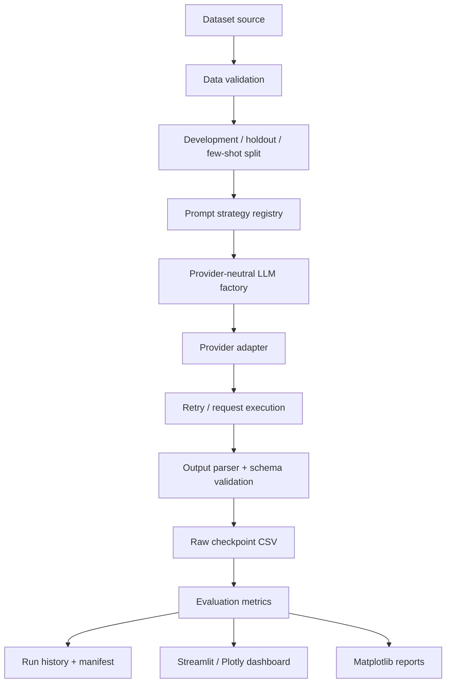

# Architecture

## High-level architecture



## Layers

### `03_src/prompt_benchmark/data`
Owns source normalization, split construction, benchmark-suite sampling and strict benchmark input validation. This layer does not call an LLM.

### `03_src/prompt_benchmark/prompts`
Owns typed prompt payloads, P0–P16 strategies, custom prompt serialization and strategy metadata. Prompt rendering is separated from provider execution.

### `03_src/prompt_benchmark/llm`
Owns the provider-neutral client interface, provider factory, response schemas and provider-specific adapters. Provider implementations are split into `llm/providers/` rather than one God module.

The common base class provides bounded retry/backoff for transient errors. Authentication and malformed-request failures are not retried.

### `03_src/prompt_benchmark/benchmark`
Coordinates one strategy over a validated dataset. It supports resumable request-level checkpoints and rejects caches created with a different provider/model/strategy/dataset/sampling configuration.

### `03_src/prompt_benchmark/evaluation`
Owns parsing, statistics and non-interactive report generation. Evaluation is intentionally reusable by CLI, notebook and UI workflows.

### `03_src/prompt_benchmark/ui`
Contains reusable Streamlit panels and persistent benchmark/playground history helpers. Business logic remains in the core package rather than in notebooks.

## Configuration
Human-editable experiment configuration is centralized under `configs/`:

- `benchmark.yaml` — split sizes, seed, output token budget;
- `providers.yaml` — provider capabilities and defaults;
- `pricing.yaml` — cost assumptions;
- `parameter_sweeps.yaml` — decoding experiment grid;
- `prompts/` — versioned prompt resources and presets.

Secrets are not configuration files. They come from the UI process environment or an ignored `.env`.

## Path management
All core code uses `prompt_benchmark.paths.PATHS`, derived from the installed package location. No user-specific absolute Windows path is required. CLI launchers change to repository root only for user convenience.

## UI runtime
The Streamlit process is the web service. Kubernetes probes use Streamlit's own `/_stcore/health` endpoint instead of adding an unnecessary FastAPI sidecar/service.

## Outputs

```text
07_outputs/
├── results/   # raw predictions, summaries, run history, playground history
├── reports/   # figures and human-readable analysis artifacts
└── logs/      # rotating application log (ignored by Git)
```
