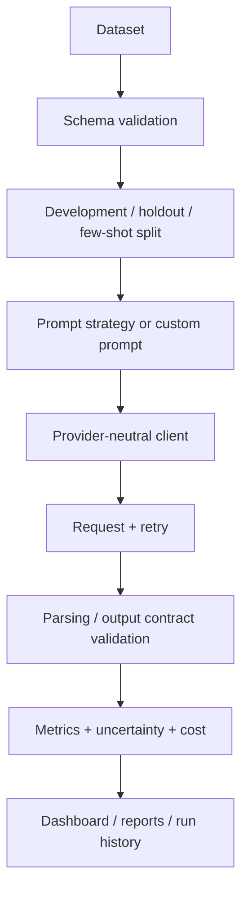

# Project Overview

## Problem
Prompt engineering is often demonstrated with a few hand-picked responses. That is insufficient for engineering decisions because a prompt can improve task quality while increasing invalid outputs, token consumption, latency, cost, or sensitivity to difficult inputs.

## Objective
The project turns prompt engineering into a controlled, reproducible benchmark. The task is support-ticket intent routing across six labels: `api`, `billing`, `cancellation`, `complaint`, `technical`, and `upgrade`.

## Engineering objective
The portfolio value is the experiment platform, not the classifier alone. The system provides leakage-safe data preparation, P0–P16 prompt strategies, custom prompt presets, provider-neutral LLM adapters, resumable execution, output validation, token/latency/cost telemetry, statistical evaluation, interactive UI, persistent run history, tests, and deployment assets.

## Approach

## Technologies
- Python: reproducible experiment logic.
- pandas/NumPy: tabular processing and sampling.
- scikit-learn: classification metrics.
- Pydantic: typed configuration validation.
- Streamlit/Plotly: interactive experiment UI.
- Matplotlib: durable report figures.
- OpenAI, Gemini, Groq, OpenRouter, Ollama: provider adapters behind one interface.
- pytest/coverage: regression and integration validation.
- Docker/Kubernetes: portable deployment assets.

## Evaluation
Quality and operations are evaluated together: Accuracy + Wilson CI, Macro Precision/Recall/F1, bootstrap F1 CI, Weighted F1, balanced accuracy, MCC, Cohen's kappa, class-wise metrics, scenario/difficulty metrics, output validity, JSON validity, token usage, latency percentiles, throughput, and estimated cost.

## Results policy
Bundled mock results are simulator outputs used to validate the software. They must not be presented as real model quality. Portfolio claims should be produced with a real provider/model and a locked benchmark protocol.

## Limitations
The bundled challenge data is synthetic, provider behavior changes over time, LLM outputs can remain nondeterministic, and cloud/API runtime validation depends on external credentials/network access.
