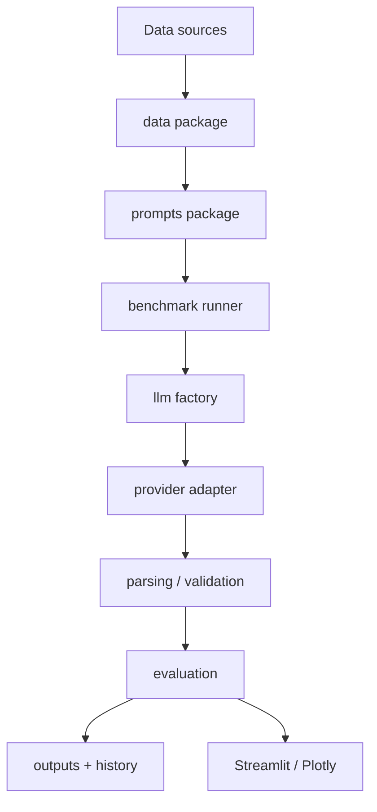

# Architecture

## Layered design

### `data`
Owns normalization, challenge-data generation, strict schema validation, deterministic split construction, benchmark profiling, and representative pilot sampling. It never calls an LLM.

### `prompts`
Owns P0–P16 strategies, custom prompts, rendering, structured-output metadata, and reusable prompt resources.

### `llm`
Defines the provider-neutral response contract, client factory, retry policy, and isolated provider adapters. Authentication or malformed-request failures are fail-fast; transient failures can use bounded exponential backoff.

### `benchmark`
Coordinates one strategy over validated data, writes request-level checkpoints, validates cache identity, and records telemetry.

### `evaluation`
Computes classification statistics, uncertainty, parsing quality, token/cost/latency measures, and reusable report data.

### `ui`
Provides bilingual interactive workflows while keeping benchmark and provider business logic in the core package.

## Configuration and paths
All human-editable settings live under `configs/`. Runtime paths are resolved through `prompt_benchmark.paths.ProjectPaths`; no developer-specific absolute path is required.

## Observability
Every benchmark can persist raw predictions, summary metrics, dataset snapshots, manifests, and figures under `07_outputs/`.
