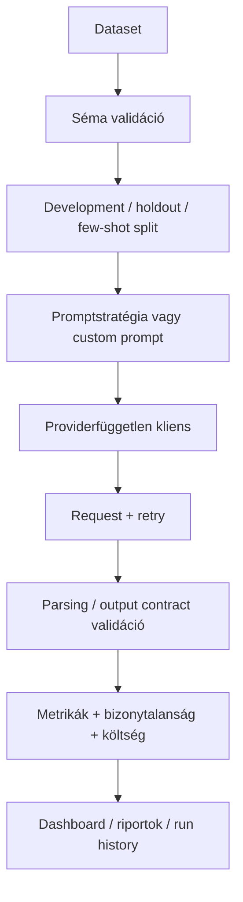

# Projektáttekintés

## Probléma
A prompt engineeringet gyakran néhány kézzel kiválasztott válasszal mutatják be. Ez mérnöki döntéshez kevés, mert egy prompt javíthatja a feladatminőséget, miközben növeli az invalid outputok számát, a tokenfogyasztást, a latencyt, a költséget vagy a nehéz inputokra való érzékenységet.

## Cél
A projekt a prompt engineeringet kontrollált, reprodukálható benchmarkká alakítja. A feladat support-ticket intent routing hat címkével: `api`, `billing`, `cancellation`, `complaint`, `technical`, `upgrade`.

## Engineering cél
A portfólióértéket nem önmagában a classifier adja, hanem a teljes experiment platform: leakage-mentes adatelőkészítés, P0–P16 promptstratégiák, custom prompt presetek, providerfüggetlen LLM adapterek, resumable futtatás, output validáció, token/latency/cost telemetria, statisztikai kiértékelés, interaktív UI, tartós run history, tesztek és deployment assetek.

## Megközelítés

## Technológiák
- Python: reprodukálható kísérleti logika.
- pandas/NumPy: táblázatos feldolgozás és mintavétel.
- scikit-learn: klasszifikációs metrikák.
- Pydantic: típusos konfigurációvalidáció.
- Streamlit/Plotly: interaktív experiment UI.
- Matplotlib: tartós riportábrák.
- OpenAI, Gemini, Groq, OpenRouter, Ollama: közös interfész mögötti provider adapterek.
- pytest/coverage: regressziós és integrációs validáció.
- Docker/Kubernetes: hordozható deployment assetek.

## Kiértékelés
A rendszer együtt méri a minőséget és az üzemeltetési költséget: Accuracy + Wilson CI, Macro Precision/Recall/F1, bootstrap F1 CI, Weighted F1, balanced accuracy, MCC, Cohen's kappa, class-wise és scenario/difficulty metrikák, output-validity, JSON-validity, tokenhasználat, latency percentilisek, throughput és becsült költség.

## Eredménypolitika
A repositoryban található mock eredmények szimulációs outputok a szoftver validálására. Ezeket nem szabad valódi LLM-minőségként bemutatni. Portfólióállításokat valós provider/model és rögzített benchmarkprotokoll alapján kell készíteni.

## Korlátok
A beépített challenge adatok szintetikusak, a providerek viselkedése idővel változik, az LLM-output nem mindig determinisztikus, az élő cloud/API validáció pedig credentialt és hálózati hozzáférést igényel.
