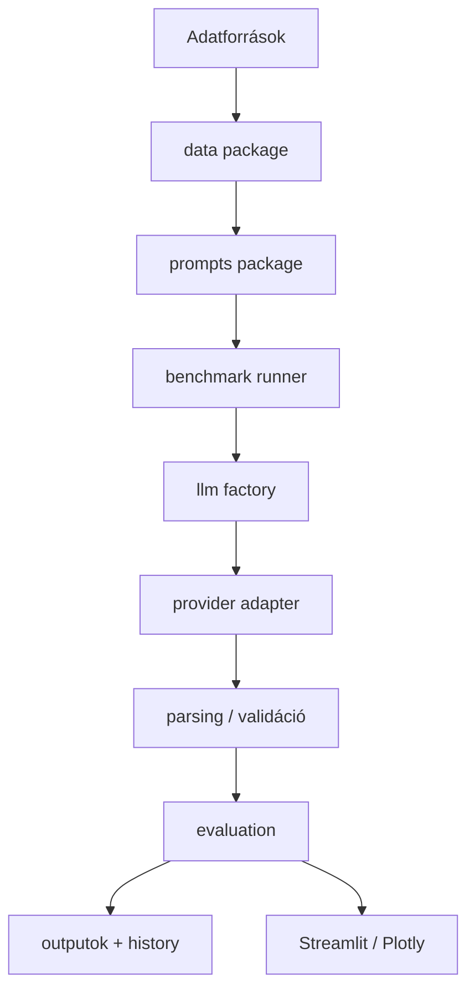

# Architektúra

## Réteges felépítés

### `data`
A normalizálásért, challenge-data generálásért, szigorú sémavalidációért, determinisztikus splitért, dataset profilozásért és reprezentatív pilot mintavételért felel. Nem hív LLM-et.

### `prompts`
A P0–P16 stratégiák, custom promptok, renderelés, structured-output metadata és prompt erőforrások rétege.

### `llm`
Közös providerfüggetlen response contractot, kliens factoryt, retry policyt és elkülönített provider adaptereket tartalmaz. Autentikációs vagy malformed-request hiba fail-fast; átmeneti hibáknál korlátozott exponential backoff használható.

### `benchmark`
Egy promptstratégia validált adaton történő futását koordinálja, request-szintű checkpointot ír, cache-identitást validál és telemetriát ment.

### `evaluation`
Klasszifikációs statisztikát, bizonytalanságot, parsing-minőséget, token/költség/latency metrikákat és újrahasznosítható riportadatot számol.

### `ui`
Kétnyelvű interaktív workflow-t biztosít, miközben a benchmark/provider business logic a core package-ben marad.

## Konfiguráció és pathok
Minden ember által szerkeszthető beállítás a `configs/` alatt található. A runtime útvonalakat a `prompt_benchmark.paths.ProjectPaths` oldja fel; nincs fejlesztőgéphez kötött abszolút path.

## Observability
Minden benchmark menthet raw predikciókat, összesített metrikákat, dataset snapshotot, manifestet és ábrákat a `07_outputs/` alá.
